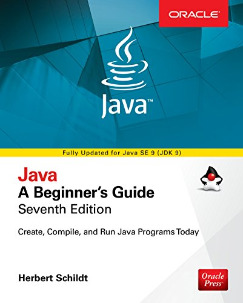

The repository contains solutions and examples for the exercises from the book described below.\
If you want to run the project locally, it can be done easily because it was developed on Docker.

## Java - A Beginner's Guide
#### Seventh Edition

Create, Compile, and Run Java Programs Today\
Herbert Schildt\
Oracle Press


## Technical prerequisites
- Unix-based OS
- Git
- Docker

## Getting started
Run the commands one by one:
```shell
git clone https://github.com/pavel-rossinsky/java-a-beginners-guide-herbert-schildt.git
cd java-a-beginners-guide-herbert-schildt
mkdir jvm-sources .m2
cp ./docker/builds/jdk/etc/env-example .env
# Open the .env file and set the right path to the project on your OS
# for example /users/you_user_name/Documents/repository/java-a-beginners-guide-herbert-schildt
docker-compose build
```
## How to compile
```
docker-compose run jdk mvn compile
```
Repeat this command after editing any *.java files
## How to run a class
Find a class that is of your interest and copy its fully-qualified name, then run:
```shell
docker-compose run jdk mvn exec:java -Dexec.mainClass={fully_qualified_class_name}
```
For instance:
```shell
docker-compose run jdk mvn exec:java -Dexec.mainClass=com.guide.c1.Example
docker-compose run jdk mvn exec:java -Dexec.mainClass=com.guide.c1.GalToLitTable
```
## How to uninstall the project
```shell script
docker-compose down -v
```

